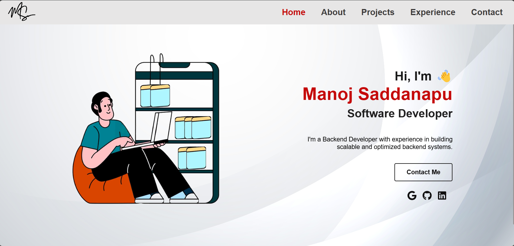

# Manoj Saddanapu - Software Engineer

Welcome to my personal portfolio website! This project showcases my journey as a developer, highlighting my skills, projects, and experience.

## Available Scripts

In the project directory, you can run:

### `npm start`

Runs the app in the development mode.
Open [My_portfolio](https://manojs1099.github.io/portfolio-website/) to view it in your browser.

The page will reload when you make changes.
You may also see any lint errors in the console.

### `npm test`

Launches the test runner in the interactive watch mode.
See the section about running tests for more information.

### `npm run build`

### `npm run eject`

## Technical Skills Used in Portfolio

- **Frontend**: React, HTML5, CSS3, JavaScript, Bootstrap, Framer Motion
- **Backend**: Node.js, Express
- **Version Control**: Git, GitHub
- **Deployment**: AWS, Netlify, Vercel
- **Other Tools**: Create React App, ESLint, Prettier

## About Me

Hi 👋, I'm Manoj Saddanapu, a 2024 graduate 🎓 with a passion for crafting robust backend systems and captivating mobile applications. As a seasoned Software Developer, I specialize in both MEAN and MERN stacks 🛠️.

Beyond coding, I love going for vacations and exploring new places. On a different note, I'm also into photography 📸 and cooking 🧑‍🍳. In photography, it's not just a hobby; I see it as a way to capture moments 🖼️, tell stories.

## Experience

###   Software Engineer - Subaru (October 2023 - July 2024)
- Engineered software solutions using Java and Spring Boot, achieving a significant reduction in processing time and enhanced system performance.
- Designed and implemented RESTful APIs, which improved data integration and increased data accuracy by 30%.
- Developed CI/CD pipelines and utilized AWS and Azure to accelerate deployment times, boosting overall operational efficiency.
- Collaborated with cross-functional teams to ensure software solutions aligned with business objectives, resulting in a 15% improvement in project delivery timelines.
- Conducted unit and integration testing to ensure software reliability, reducing production bugs and maintaining software quality.
- Established data analytics and reporting features with SQL and BI tools, enabling better resource allocation and actionable insights.

### Full Stack Software Engineer Intern - ZT Systems (May 2023 - August 2023)
- Built and maintained high-performance web applications using React, Node.js, and MongoDB, enhancing user satisfaction for online banking and investment platforms.
- Developed secure RESTful APIs, reducing transaction errors by 30% through enhanced data integration and third-party integrations.
- Optimized application performance by leveraging AWS services (EC2, S3, Lambda), leading to significant improvements in load times and scalability.
- Collaborated with cross-functional teams to design and deploy new features, ensuring alignment with business objectives and increasing feature adoption.
- Implemented unit and integration tests, improving code reliability and quality by 35%.

### Software Engineer - Capgemini Technology ( May 2020 - August 2022)
- Developed and optimized scalable software using Java, Python, and SQL, increasing operational efficiency for diverse client applications.
- Implemented Agile methodologies, accelerating project delivery times by 20% and enhancing team collaboration.
- Optimized databases using SQL and NoSQL technologies, achieving faster data retrieval and high-volume data processing capabilities.
- Worked with various teams to gather requirements and deliver software that aligned with business goals, achieving a 25% client satisfaction increase.
- Reduced operational costs by 18% through effective use of AWS and Azure in deployment, ensuring scalability and cost-efficiency.
- Conducted rigorous testing and performance tuning to improve application functionality and user experience.

## Technical Skills

- **Programming Languages**: Java, Python, C, C++
- **Frontend**: React, AngularJS, HTML5, CSS3, JavaScript, Bootstrap, Framer Motion
- **Backend**: Node.js, Express, Django
- **Databases**: SQL, MySQL, PostgreSQL, MongoDB, Cassandra
- **Cloud & DevOps**: Docker, Kubernetes, AWS (S3, EC2, Lambda)
- **APIs**: RESTful API, SOAP
- **Version Control**: Git, GitHub
- **Other Tools**: Jenkins, Netlify, Vercel, Create React App, ESLint, Prettier

## Projects

### Health Harbor (Hospital Management System)
- Implemented advanced encryption to secure patient data, achieving compliance with data protection regulations and enhancing data integrity.
- Enhanced database schema, resulting improvement in query performance and a reduction in record retrieval time by 40%.
- Resulted and integrated streamlined appointment management features, leading increase in scheduling efficiency and reduced patient wait times.
- Collaborated with a multidisciplinary team to design and deploy new healthcare service features, improving overall system efficiency.
- Automated data backup processes, reducing manual effort by 50% and increasing system reliability and recovery speed.

Feel free to reach out if you have any questions or comments!

- Email: manoj.s91099@gmail.com
- LinkedIn: [My LinkedIn Profile](www.linkedin.com/in/manoj-sa72199126)
